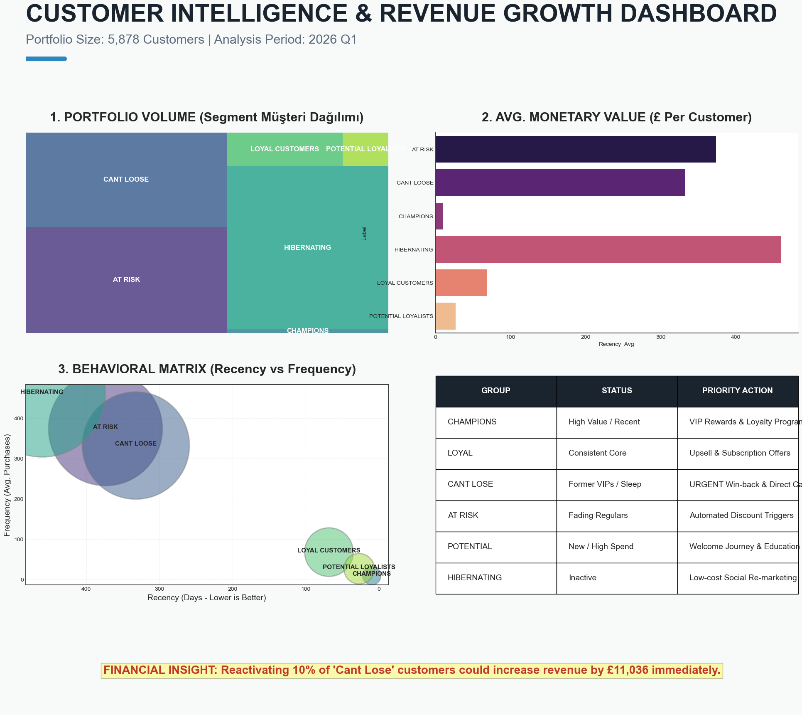

# customer-segmentation-rfm-analysis
Strategic customer segmentation and revenue growth analysis using Python (RFM Modeling) on 800K+ e-commerce transactions.
# 📊 Strategic Customer Segmentation (RFM Analysis)

This project transforms 800,000+ raw e-commerce transaction records from the **Online Retail II** dataset into an actionable business growth strategy using Python.

## 🚀 Key Business Impact
- **Identified £11,036 immediate revenue potential** by reactivating just 10% of high-value "Cant Lose" customers.
- Segmented **5,878 unique customers** into 6 behavioral archetypes to optimize marketing ROI.
- Created an **Executive Dashboard** that simplifies complex behavioral data into strategic actions.

## 🛠️ Tech Stack & Tools
- **Python:** Pandas, Numpy.
- **Visualization:** Seaborn, Matplotlib, Squarify (for Treemaps).
- **Analysis:** RFM (Recency, Frequency, Monetary) Modeling.

## 📈 Dashboard Preview

## 📂 Data Source
Due to GitHub's file size limits, the raw dataset (`online_retail_2.csv`) is not included. You can download it here:
* **Source:** [UCI Machine Learning Repository - Online Retail II](https://archive.ics.uci.edu/dataset/502/online+retail+ii)

## 💡 Strategic Recommendations
- **Champions:** Focus on VIP rewards and early access.
- **Cant Lose:** URGENT win-back campaigns and direct outreach.
- **At Risk:** Automated "We Miss You" emails with special discounts.

---
*Developed as part of my Data Science Portfolio - 2026*
